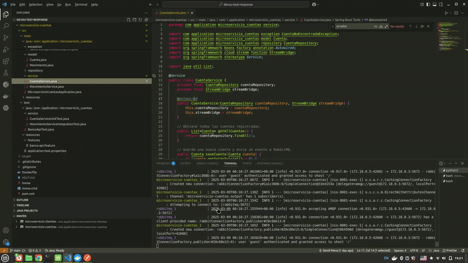

# Microservicios Banco (Resumen)

Resumen paso a paso para desplegar y ejecutar ambos microservicios, incluyendo la ejecución de una prueba unitaria, una prueba de integración y karate dsl para verificar los APIs.

**Resumen rápido de los pasos:**
1. Descarga el proyecto de git `git clone <URL_REPOSITORIO> ; cd microservicio-cuentas; git checkout main`
2.  Asegúrate de tener Docker y Docker Compose instalados y en ejecución, tambien debes tener todos las dependencias mencionadas despues. Recomiendo abrir Docker Desktop para visualizar los contenedores mejor.
3.  Reinicia los contenedores y limpia la caché con `docker-compose down -v` y `docker system prune -af`, solo si es necesario.
4.  Inicia los contenedores desde la raíz del proyecto con `docker-compose up --build`.
5.  Una vez que los contenedores estén en funcionamiento, navega al directorio `microservicio-cuentas` y ejecuta `./mvnw test` para realizar las pruebas unitarias y de integración (Karate DSL).

## Demo Aplicacion
- video en la carpeta mediae-examples

**Mas Detalles de todos los pasos y configuraciones:**

## Tecnologías
-   Java 17, Spring Boot 3.4.3
-   Spring Data JPA (MySQL, H2)
-   RabbitMQ
-   Docker, Maven
-   JUnit 5, Mockito, Karate DSL
-   Postman (opcional)

## Requisitos
-   Docker, Docker Compose
-   Maven
-   Git (opcional)
-   Postman (opcional)

## Estructura Proyecto (Microservicio Clientes)
-   **Modelos:** `Cliente`, `Persona` (JPA)
-   **Repositorios:** `ClienteRepository`, `PersonaRepository`
-   **Servicios:** `ClienteService` (Lógica de negocio)
-   **Controladores:** `ClienteController` (REST endpoints)

## Estructura Proyecto (Microservicio Cuentas)
-   **Modelos:** `Cuenta`, `Movimiento` (JPA)
-   **Repositorios:** `CuentaRepository`, `MovimientoRepository`
-   **Servicios:** `CuentaService`, `MovimientoService` (Lógica de negocio)
-   **Controladores:** `CuentaController`, `MovimientoController`, `ReporteController` (REST endpoints)
-   **Excepciones:** Manejo de errores (ej. `SaldoNoDisponibleException`)
-   **Pruebas:** Unitarias, Integración y Karate DSL

## Despliegue y Ejecución
1.  **Clonar:** `git clone <URL_REPOSITORIO> ; cd microservicio-cuentas; git checkout main`
    -   Asegurarse que este en la rama main.
2.  **Docker:** `docker-compose down -v`,  `docker system prune -af` y `docker-compose up --build`
4. **Ejecutar pruebas:** Navega al directorio `microservicio-cuentas` y ejecuta `./mvnw test` desde este directorio. Esto ejecutará las pruebas unitarias y de integración y Karate DSL para probar los endpoints.

## Endpoints (Clientes - http://localhost:8080)
-   **Cuentas:**
    -   `GET /api/clientes`: Listar
    -   `POST /api/clientes`: Crear
    -   `PUT /api/clientes/{identificacion}`: Actualizar
    -   `DELETE /api/clientes/{identificacion}`: Eliminar

## Endpoints (Cuentas - http://localhost:8081)
-   **Cuentas:**
    -   `GET /api/cuentas`: Listar
    -   `POST /api/cuentas`: Crear
    -   `PUT /api/cuentas/{numeroCuenta}`: Actualizar
    -   `DELETE /api/cuentas/{numeroCuenta}`: Eliminar
-   **Movimientos:**
    -   `GET /api/movimientos`: Listar
    -   `POST /api/movimientos`: Registrar (depósito/retiro)
    -   `GET /api/movimientos/{id}`: Obtener por ID
    -   `PUT /api/movimientos/{id}`: Actualizar
    -   `DELETE /api/movimientos/{id}`: Eliminar
-   **Reportes:**
    -   `GET /api/reportes?fechaInicio=dd/MM/yyyy&fechaFin=dd/MM/yyyy&cliente=<identificacion>`: Reporte por cliente y fechas

## Base de Datos
-   **Producción:** MySQL (Docker Compose)
-   **Pruebas:** H2 (memoria, perfil `test`)

## Pruebas
-   **Unitarias/Integración:** `src/test/java/com/application/microservicio_cuentas/service` (`CuentaServiceUnitTest`, `MovimientoServiceIntegrationTest`). Ejecutar: `./mvnw test` desde el directorio `microservicio-cuentas`.
-   **API (Karate DSL):** Ejecutar: `./mvnw test` desde el directorio `microservicio-cuentas`.
-   **Manuales (Postman - Opcional):** Importar `postman.json` en Postman, ejecutar todos los endpoints.

## Detalles
- Realice el programa en un ordenador con linux mint, no lo he probado en Windows o Mac.

## Muchas Gracias!
